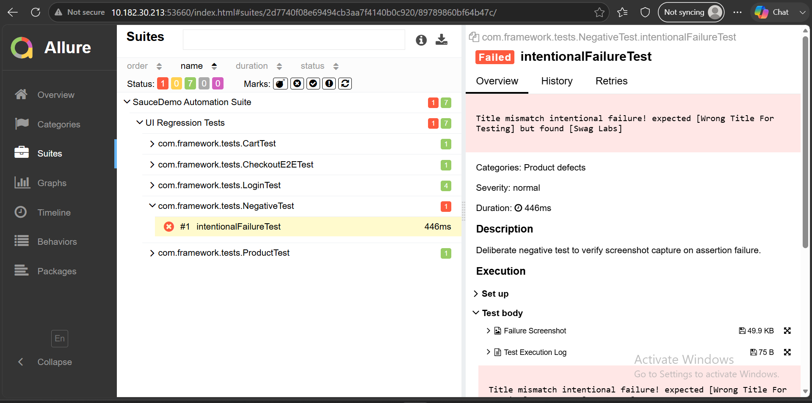

# SauceDemo Selenium Java Automation Framework

An enterprise-grade test automation framework built using **Java 21**, **Selenium WebDriver**, **TestNG**, and **Maven**, featuring the **Page Object Model (POM)** design pattern, comprehensive real-time logging via **Log4j2**, and advanced HTML reporting via **Allure** and **Extent Reports**.

---

## 🛠️ Tech Stack & Dependencies

* **Language:** `Java 21`
* **Automation Tool:** `Selenium WebDriver v4.46.0`
* **Test Framework:** `TestNG v7.12.0`
* **Build Management:** `Apache Maven`
* **Logging:** `Log4j2` & `SLF4J`
* **Reporting:** `Allure TestNG` & `Extent Reports`
* **Utilities:** `Jackson Databind`, `JavaFaker`, `Commons IO`

---

## 📂 Project Structure

```text
saucedemo-selenium-java-framework/
│
├── src/
│   ├── main/
│   │   ├── java/
│   │   │   ├── com/framework/base/       # BaseTest & Driver setup
│   │   │   ├── com/framework/driver/     # DriverFactory configuration
│   │   │   ├── com/framework/listerners/ # TestNG Listeners & Allure hooks
│   │   │   ├── com/framework/pages/      # Page Object Model classes
│   │   │   └── com/framework/utils/      # Config readers & Screenshot utilities
│   │   └── resources/
│   │       ├── log4j2.xml               # Logging configuration
│   │       └── config.properties        # Application URLs & credentials
│   │
│   └── test/
│       ├── java/
│       │   └── com/framework/tests/      # Test cases (Login, Cart, Checkout, Negative)
│       └── resources/
│           └── allure.properties         # Allure result path configurations
│
├── pom.xml                               # Maven project object model
└── testng.xml                            # TestNG suite configuration file

---

## 🚀 Key Features

* **Page Object Model (POM):** Clean structural separation of test scripts and UI element locators for high maintainability.
* **Automated Failure Screenshots:** Custom `TestListeners` automatically capture browser screenshots and attach them directly to Allure reports on test failure.
* **Dynamic Logging:** `Log4j2` integration tracks execution flows, assertions, and navigation steps in real-time.
* **Allure & Extent Reporting:** Generates rich, interactive HTML reports featuring detailed timelines, execution steps, and failure logs.
* **Negative Test Validation:** Includes dedicated test scenarios designed to assert application error states and verify robust error-handling routines.

---

## 💻 How to Run the Tests

Execute the full automated test suite locally using **Apache Maven** via your terminal:

```bash
mvn clean test

```

---

## 📊 Generating & Viewing Allure Reports

1. Run the test suite to compile sources and generate execution result artifacts:
   ```bash
   mvn test


2. Launch the interactive **Allure Report Dashboard**:
   ```bash
   mvn allure:serve


---

## 📸 Dashboard Preview

Here is a preview of the interactive **Allure Test Execution Report** demonstrating test suites, failure logging, and automated screenshot attachments:

<div align="center">
  
</div>
